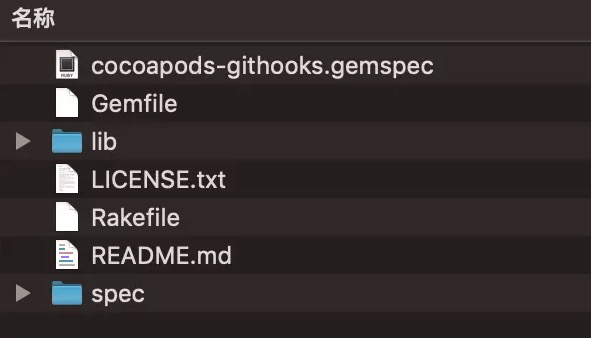

CocoaPods Plugins 是一个Ruby gem，你需要安装Ruby和CocoaPods来为你的插件开发做准备。
要开始开发一个新的插件，你还需要安装cocoapods-plugins :

```undefined
gem install cocoapods-plugins
```

为了演示和调试的目的，我们要先创建一个xcode工程，并且在其根目录下执行

```undefined
git init
pod init
```

将其初始化为一个git仓库，以及添加Podfile到该工程

### 创建CocoaPods Plugins

运行下面的命令就可以生成一个插件模板工程

```undefined
pod plugins create githooks
```

工程目录是这样的




.gemspec文件是插件的主要配置文件。所有的spec字段都是自描述的(你可以查看我们的[cocoapods-plugins](https://github.com/CocoaPods/cocoapods-plugins/blob/master/cocoapods-plugins.gemspec))，但是我想指出一件事:

> 默认情况下，spec.files是指向git仓库并引用其中的文件。但是如果您试图在git仓库中没有文件(还未进行版本控制)时构建gem，您将得到一个空的.gem文件，同时会没有任何警告或错误。我的建议是现在就将spec.files的值设置为Dir[' lib/**/* ']，它将引用lib目录下的所有文件。

替换其中spec.files这一行为

```bash
spec.files = Dir['lib/**/*']
```

Gemfile会包含所需的全部gem依赖。查看[Bundle Doc](http://bundler.io/man/gemfile.5.html) 以获得更多信息
Rakefile包含测试所需要的引用，spec文件夹包含测试用例。有关Rake的更多信息，请访问[官方Rake repo](https://github.com/ruby/rake)。
我们现在还不需要更改Gemfile和Rakefile，所以保持其原样。
lib是我们要使用的主文件夹。它包含构建.gem的所有ruby文件。
为了确保一切设置正确，运行下面的的命令:

```css
gem build cocoapods-githooks.gemspec
```

你将看到'Successfully built RubyGem'的成功消息，同时Cocoapods-githooks-0.0.1.gem 也将会出现在目录之下

### 实现插件

Cocoapods-githooks这个插件我们只需要它做一件简单的事情：将项目的.git-hooks目录中的所有文件复制到.git/hooks/目录中，并在每次运行podinstall、pod update 或 pod githooks时执行这个操作。
为了实现这一点，我们将创建一个执行文件操作的类，并将其链接到 pre-install和post-install这两个CocoaPods钩子以及githooks命令。
在/lib/cocoapods-githooks中创建githooks-sync.rb文件
Require'cocoapods'和“fileutils”模块，并在CocoapodsGitHooks模块中使用同步方法创建GitHooksSync类。

```ruby
require 'cocoapods'
require 'fileutils'
module CocoapodsGitHooks
    class GitHooksSync
        def sync

        end
    end
end
```

在复制git-hook之前，我们需要检查一些事情:
确保我们在git仓库中
确保.git-hooks目录存在
确保.git-hooks目录不是空的
我们可以通过在sync方法的开头添加下面的条件语句来实现这一点:

```ruby
if !File.directory?(".git")
    Pod::UI.puts "Git repository not found"
    return
end
if !File.directory?(".git-hooks")
    Pod::UI.puts ".git-hooks directory not found, nothing to sync"
    return
end
if Dir['.git-hooks/*'].empty?
    Pod::UI.puts ".git-hooks directory is empty, nothing to sync"
    return
end
```

在这之后，我们检查hooks目录是否存在于.git中，如果不存在，创建它:

```ruby
if !File.directory?(".git/hooks")
    FileUtils.mkdir ".git/hooks"
end
```

现在我们准备将钩子从.git-hooks复制到.git/hooks:

```undefined
FileUtils.cp_r(“.git-hooks/.”, “.git/hooks/”)
```

下一步是删除shell脚本文件扩展名(如果存在)使文件可执行:

```ruby
path = ".git/hooks/"
Dir.open(path).each do |p|
    filename = File.basename(p, File.extname(p))
    if File.extname(p) == ".sh"
        FileUtils.mv("#{path}/#{p}", "#{path}/#{filename}")
    end      
    FileUtils.chmod("+x", "#{path}/#{filename}")
end
```

我们还添加了两个UI.puts 在同步方法的开始和结束处显示具有同步状态的系统通知。如果你遵循了上面所有的步骤，您得到的githook -sync.rb文件看起来如下所示:

```ruby
require 'cocoapods'
require 'fileutils'
module CocoapodsGitHooks
    class GitHooksSync
        def sync
            Pod::UI.puts "Synchronizing git hooks"
            if !File.directory?(".git")
                Pod::UI.puts "Git repository not found"
                return
            end
            if !File.directory?(".git-hooks")
                Pod::UI.puts ".git-hooks folder not found, nothing to sync"
                return
            end
            if Dir['.git-hooks/*'].empty?
                Pod::UI.puts ".git-hooks folder is empty, nothing to sync"
                return
            end
            if !File.directory?(".git/hooks")
                FileUtils.mkdir ".git/hooks"
            end
            FileUtils.cp_r(".git-hooks/.", ".git/hooks/")
            path = ".git/hooks/"
            Dir.open(path).each do |p|
                filename = File.basename(p, File.extname(p))
                if File.extname(p) == ".sh"
                    FileUtils.mv("#{path}/#{p}", "#{path}/#{filename}")
                end      
                FileUtils.chmod("+x", "#{path}/#{filename}")
            end
            Pod::UI.puts "Git hooks synchronized"
        end
    end
end
```

### 注册CocoaPods钩子

现在让我们在每次pod install 或pod update之后调用sync方法。为此，我们需要在CocoaPods钩子管理器中注册post_install和post_update钩子。打开lib/cocoapods_plugin.rb写下下面的内容：

```ruby
require 'command/githooks'
require_relative 'githooks-sync'
module CocoapodsGitHooks
    Pod::HooksManager.register('cocoapods-githooks', :post_install)
    do |context|
        GitHooksSync.new.sync()
    end
    Pod::HooksManager.register('cocoapods-githooks', :post_update)
    do |context|
        GitHooksSync.new.sync()
    end
end
```

正如你所看到的，我们在HooksManager中注册了post_install和post_update钩子，每次用户运行pod install或pod update后，都会调用GitHooksSync类的sync方法。

### 测试

先构建这个gem：

```css
gem build cocoapods-githooks.gemspec
```

安装并运行：

```css
gem install cocoapods-githooks-0.0.1.gem
```

如果你遇到权限问题的话：

```css
gem install cocoapods-githooks-0.0.1.gem --user-install
```

运行这条命令以确保安装正确。它应该出现在已安装插件的列表中

```css
pod plugins installed
#输出
- cocoapods-githooks    : 0.0.1 (post_install and post_update hooks)
```

如果您看到弃用警告，不要担心，我们将在下一个步骤中修复它。
现在让我们回到测试项目。打开Podfile，在开头添加:

```bash
plugin 'cocoapods-githooks'
```

回到命令行执行：

```undefined
pod install
```

你应该会看到下面两行打印的内容：

```cpp
Synchronizing git hooks
.git-hooks directory not found, nothing to sync
```

这是因为我们没有创建.git-hooks目录。创建一个空的pre-commit.sh文件，并将其放入.git-hooks目录。
回到命令行执行：

```undefined
pod update
```

你会看到下面的输出

```java
Synchronizing git hooks
Git hooks synchronized
```

现在检查.git/hooks目录，它应该包含pre-commit这一可执行文件。

### 添加自定义CocoaPods命令

添加新命令非常简单。您只需要创建command类的子类。打开lib/cocoapods-githooks/command/githooks.rb，将其内容替换为:

```ruby
require 'cocoapods'
require 'cocoapods-githooks/githooks-sync'
include CocoapodsGitHooks
module Pod
    class Command
        class Githooks < Command
            self.summary = <<-SUMMARY
                Syncs hooks between team members
            SUMMARY
            self.description = <<-DESC
                CocoaPods plugins that syncs git-hooks placed in .git-hooks directory between team members
            DESC
            self.arguments = []
            def run
                CocoapodsGitHooks::GitHooksSync.new.sync()
            end
        end
    end
end
```

它是一个简单的githooks命令，不带参数并调用sync方法。
现在 rebuild和重装重新构建后的gem：

```css
gem build cocoapods-githooks.gemspec
gem install cocoapods-githooks-0.0.1.gem
```

删除.git中的hooks目录然后执行：

```undefined
pod githooks
```

### 下面是发布时间

> 请保持官方 RubyGems 的整洁，避免发布测试和演示用的gem

发布CocoaPods插件需要两个步骤。首先，您需要创建一个帐户，然后将您的gem publish到RubyGems.org。之后你可以直接从RubyGems安装插件:

```undefined
gem install cocoapods-PLUGIN_NAME
```

如果你想让你的插件被列在官方cocoapods插件列表中，运行:

```undefined
pod plugins publish
```

它将在[cocoapods-plugins](https://github.com/CocoaPods/cocoapods-plugins)库中创建一个issue并要求将您的插件添加到官方列表中。为了加速这个过程，您可以fork cocoapods-plugins，将生成的json对象添加为plugins.json文件中plugins数组中的最后一个对象，并创建一个pull请求。

### 最后

我们已经构建了一个非常简单的CocoaPods插件，但是你可以在这个强大的工具上添加更多的东西。如果你想为你未来的项目寻找灵感，可以运行以下程序浏览现有的多个插件:

```cpp
pod plugins list
```